# Fake Passport Detector

This is a project made by [Kevin Joshi](https://github.com/KevinJ-hub), [Kaushal Binjola](https://github.com/KaushalBinjola) & [Rajas Bondale](https://github.com/Rajas-B).  
Database used is PostgreSQL, the fake passport report images are stored on [cloudinary](https://cloudinary.com/), the passport details are stored on Goerli test network with the profile image and signature image being stored on ipfs which is deployed using the api provided by [web3.storage](https://web3.storage/). The fake passport analysis graphs are generated using [Highcharts](https://www.highcharts.com/).  

- This is a web app build using django where the passport details are stored on blockchain which when included to the existing passport verification process (conducted at airports) existing in India makes it more robust and easy to detect fake passports.  
- The app also provides graphs that help analyze and get useful information to track down fake passport reports over time and in various geographical locations.  
- There are three main authorities, the passport issuing authority, passport verifying authority and the security officials present at the airports.  
- The flow is as follows:
  - The passport issuing authority creates and edits the passports as well as has access to the analysis of the fake passports reported.
  - The passport verifying authority enters the passport number of the passenger and checks if the physical passport provided is a legitimate passport or not, if not then they can report the fake passport.
  - The security officials of the specific airport where the fake passport has been reported will be alerted about the same by email.

## Tech Used

- Ethereum Blockchain
- Solidity
- Infura
- Web3.py
- Ipfs
- Web3.storage
- Django
- Python
- PostgreSQL
- Cloudinary
- Javascript
- Highcharts
- Bootstrap5
- Font Awesome

## Architecture

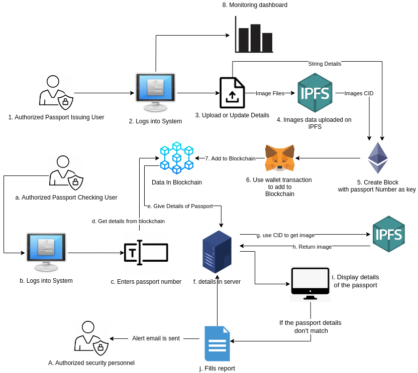

## Running this project

1. Clone the repository
2. Create the env file using the env-sample file
3. Run the following command from the root of the project

```bash
pip install -r requirements.txt
```

```bash
py manage.py makemigrations
```

```bash
py manage.py migrate
```

4. Create a super user to access django admin panel (For creating issuer, verifier and security users)

```bash
py manage.py createsuperuser
```

5. Run the server

```bash
py manage.py runserver
```

> **NOTE:** You can also create a virtual environment, activate it and follow the above steps.

## Images

### Desktop

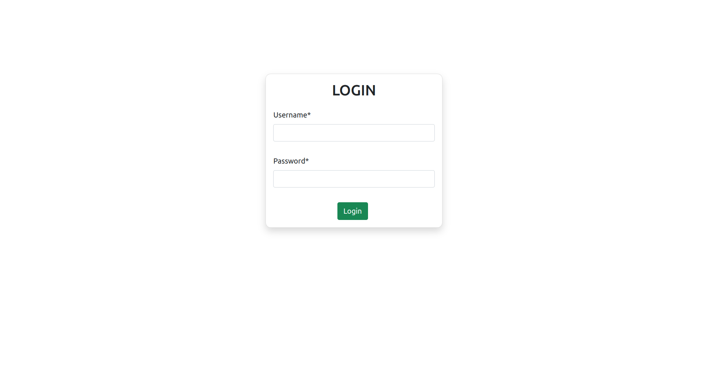
---

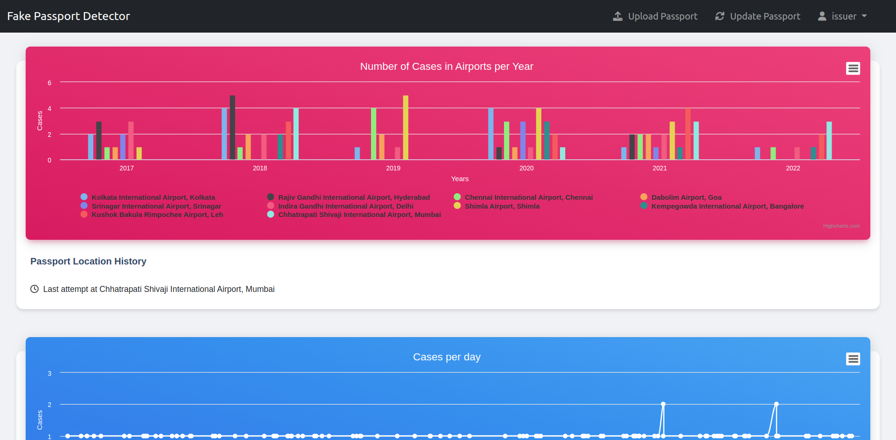
---

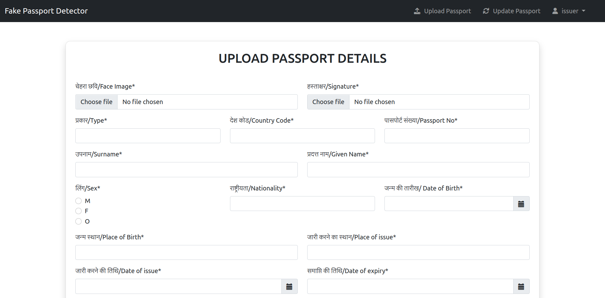
---

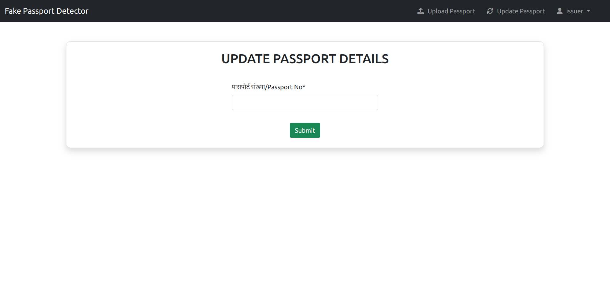
---

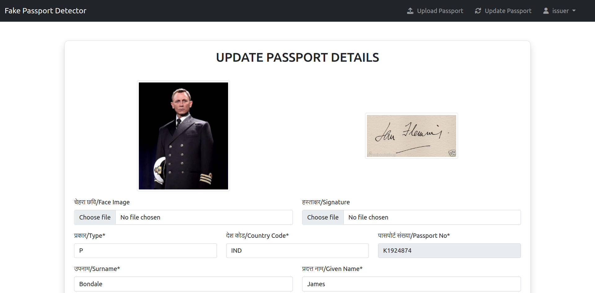
---

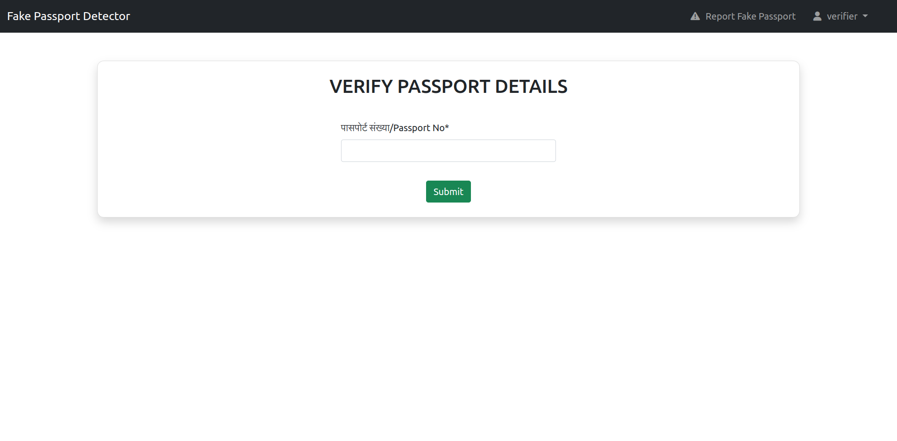
---

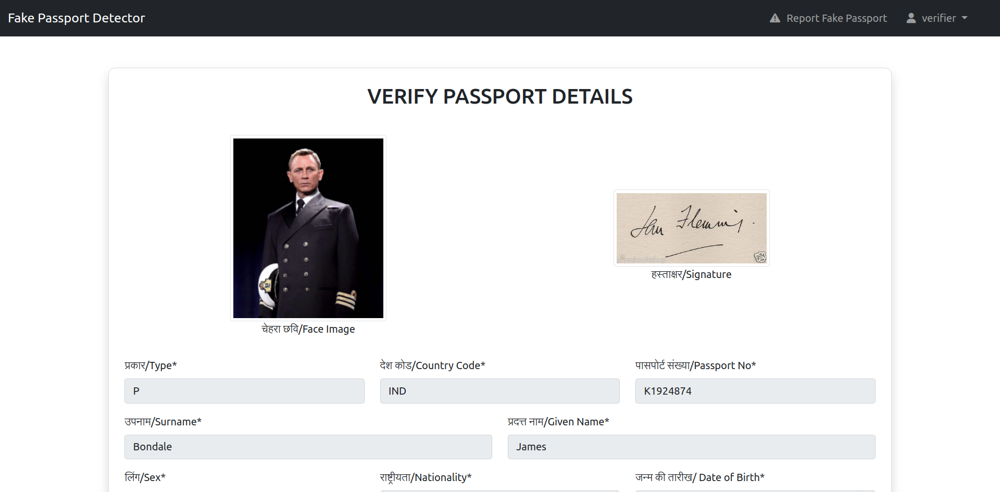
---

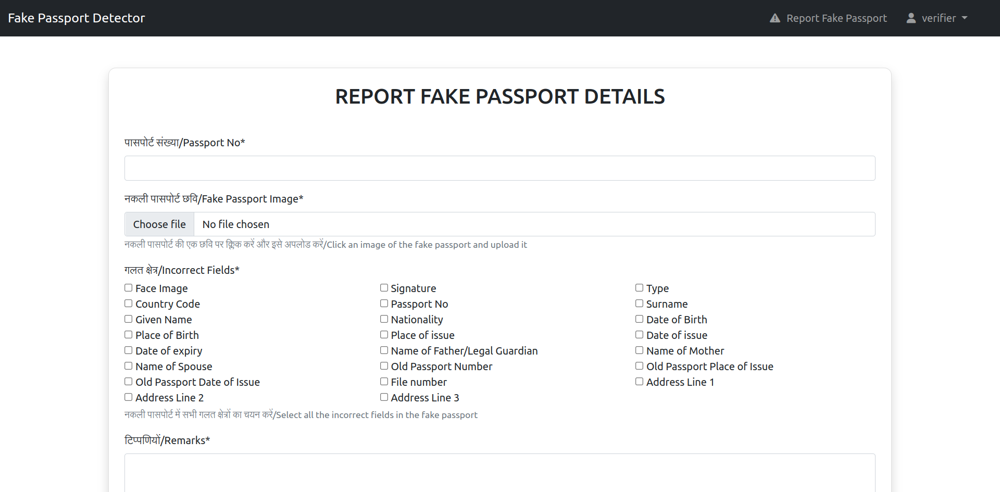
---

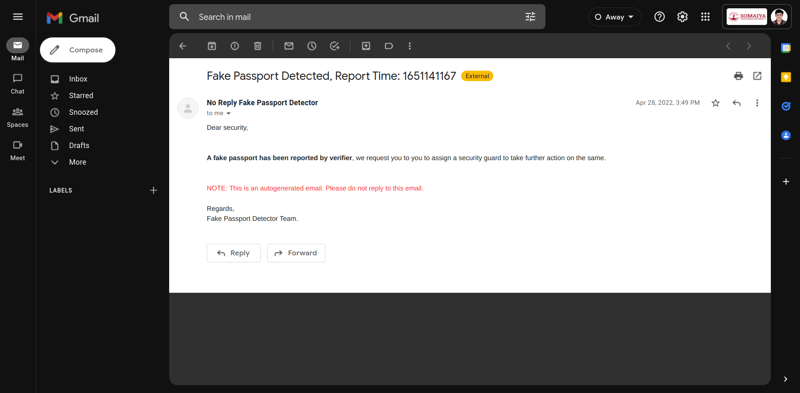

### Mobile Devices

|  | 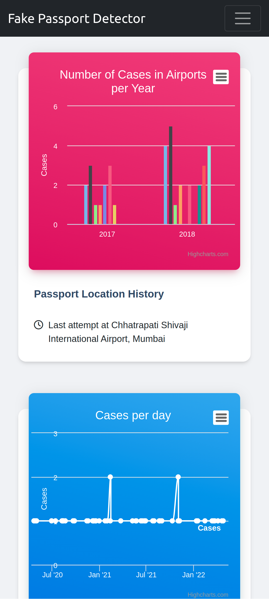 | 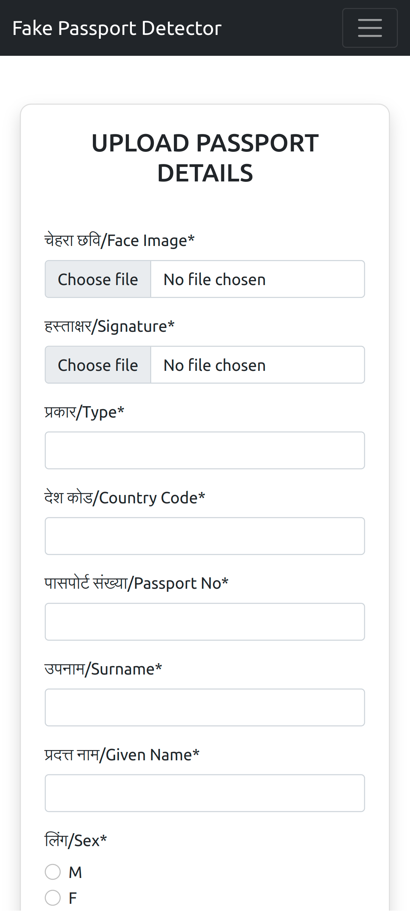 | 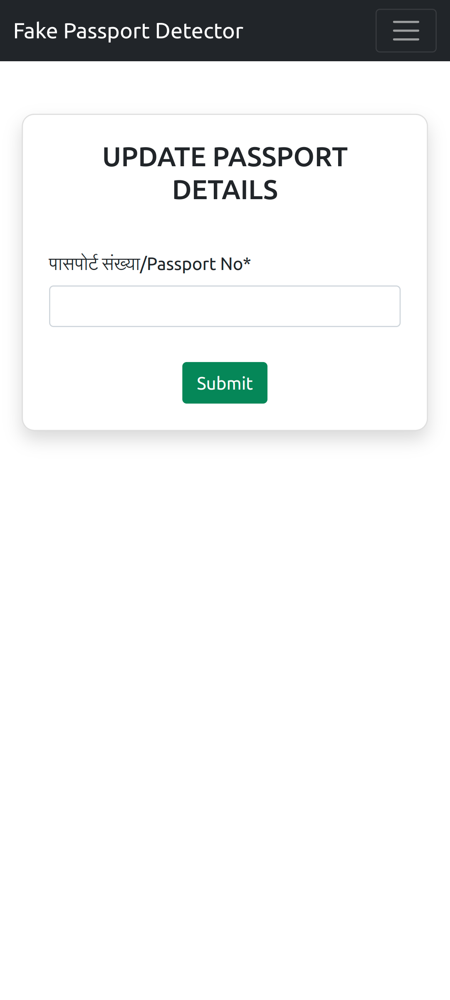 |
|---|---|---|---|
| 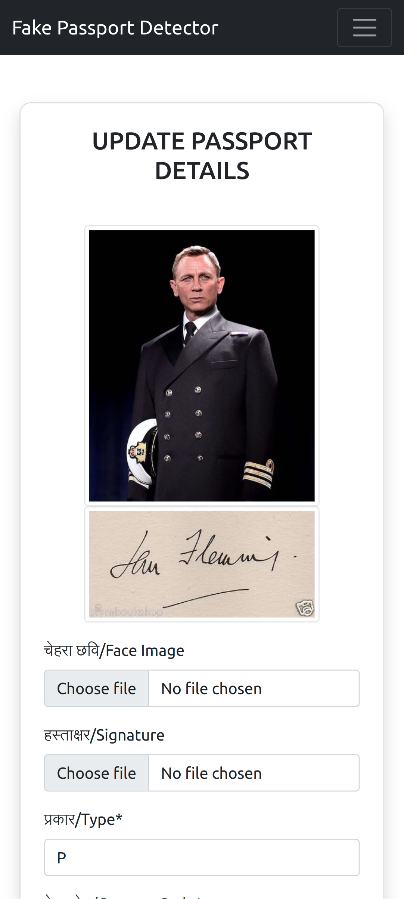 | 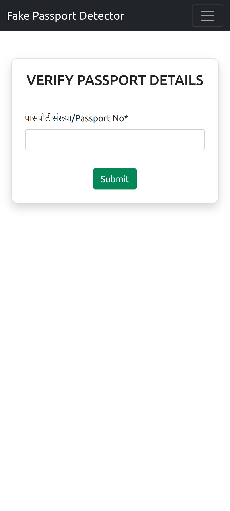 | 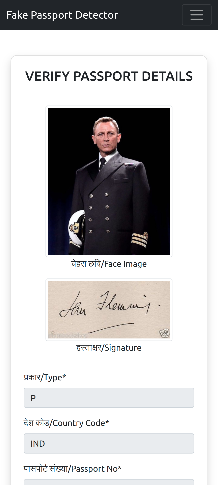 | 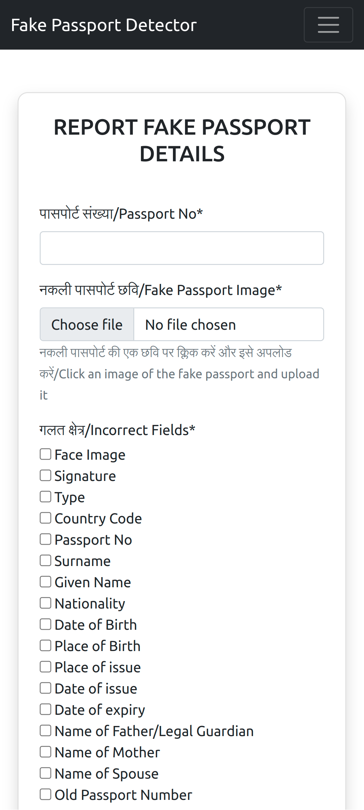 |  
